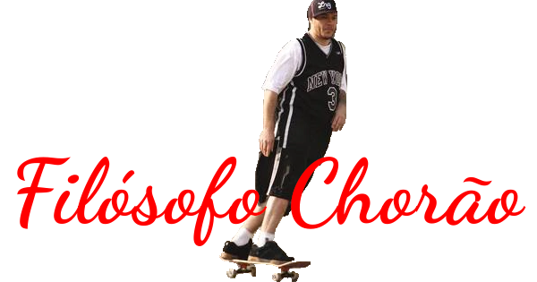

<div align="center">
  
  <p>Grandes frases do maior filósofo que já pisou em um skate.</p>

  <p align="center">
    <sub>Desenvolvido com :heart: por
      <a href="https://github.com/MatheusMuriel">Matheus Muriel</a> e
      <a href="https://github.com/MatheusMuriel/FilosofoChorao/graphs/contributors">contribuidores</a>
    </sub>
  </p>

  <!-- <a href=".github/README-pt-BR.md">Português</a>
   / <a href=".github/README-fr.md">English</a>
   / <a href=".github/README-es.md">Español</a> -->
</div>

---
Para ver o projeto rodando: [https://matheusmuriel.github.io/FilosofoChorao/index.html](https://matheusmuriel.github.io/FilosofoChorao/index.html)
#### Screenshot


## Motivação
Um dia enquanto eu estava programando para alguns projetos da Hacktoberfest e ouvindo Charlie Brown Jr. de fundo, eu percebi a genialidade das frases contadas pelo eterno filósofo skatista e como estava dificil achar projetos legais para contribuir, então descidi juntar as duas coisas.

## O que é isto?
Esse projeto foi feito com **HTML**, **JavaScript**, **CSS** _(Usando Flexbox)_ e o auxílio do framework [VueJS](https://vuejs.org/), com o objetivo juntar e disseminar esse conhecimento pelo mundo.

## Como contribuir com novas frases?
Video de exemplo: [Guia de contribuição Hacktoberfest](https://hacktoberfest.digitalocean.com/details#beginners).  
Siga os passos normais para uma contribuição: 
1. Fork esse repositório.
2. Clone na sua maquina.
3. Siga os passos para [adicionar frases](#frases).
4. Faça os commits.
5. Crie uma PR.
  
### <a name="frases"></a> Como adicionar Frases
As frases estão armazenadas no arquivo [frases.json](https://github.com/MatheusMuriel/FilosofoChorao/blob/main/frases.json), adicione as novas frases no final do arquivo, utilizando a seguinte estrutura: 

```JSON
{
    "frase": "Coração de vagabundo bate na sola do pé",
    "musica": "Champanhe e Água Benta - Charlie Brown Jr.",
    "video": "https://www.youtube.com/watch?v=DVhBBr9OgWc",
    "tempo": "1m05s"
}
```
Explicação:
- **frase**: Frase recitada pelo Choris.
- **musica**: Nome da musica _(No formato Musica - Banda)_.
- **video**: Link de Youtube em que está citada a frase.
- **tempo**: Tempo do video em que essa frase é dita _( No formato \_m\_ \_s ou seja, **minuto** m **segundo** s )_.

**Regras**: 
1. Para manter o meu controle de **não** qualidade não serão aceitas frases serias, somente frases engraçadas (ou estranhas).
2. Não serão aceitos Pull Requests com campos faltando no JSON.

## Quer sugerir mudanças?
Basta [criar uma Issue]() descrevendo a sugestão e eu irei analizar se ela se encaixa ou não na ideia do projeto.

## Agradecimentos
Meus agradecimentos a [Isabelli Russo](https://github.com/isabelirusso-dev) que me ajudou nas traduções e layout, e a todos os outros [contribuidores](https://github.com/MatheusMuriel/FilosofoChorao/graphs/contributors).  
E também meus agradecimentos ao projeto [FilosoFunk](https://github.com/IgorRozani/filosofunk) que me inspirou na ideia do projeto.  

## Licença
[GPLv3](LICENSE) <span style="display:inline-block;transform: rotate(180deg);">&copy;</span> 2020 [Matheus Muriel](https://github.com/MatheusMuriel/)